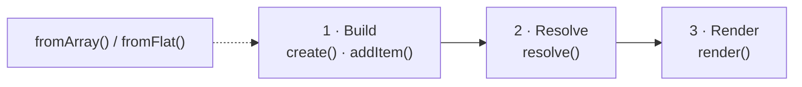

# Concepts

`cakephp-menu` cleanly separates three concerns. Keeping them apart is what makes the same menu
definition reusable across requests, roles, and output formats.

## 1. Build

You declare *what is in the menu* — a tree of items, each with a label, an optional link, and
optional metadata (icons, badges, `data`). Building is request-agnostic: no knowledge of the current
URL, the logged-in user, or the eventual markup. You can build in code, or import a tree with
[`Menu::fromArray()`](/reference/cheatsheet#menu) (config) or
[`Menu::fromFlat()`](/reference/cheatsheet#menu) (database rows).

## 2. Resolve

[Resolvers](/guide/resolvers) apply *per-request state* onto the built tree — which item is active,
which branch is an ancestor of the active item, and which items are visible to the current user. The
helper applies URL resolvers automatically; you compose additional ones (login, permission,
authorization, callback) on top. Resolution mutates *runtime* state only, so the same menu can be
re-resolved for a different request.

## 3. Render

[Renderers](/guide/rendering) turn the resolved tree into output — HTML for one of the bundled
renderers (string template, Bootstrap 5, navbar, sidebar, breadcrumb) or a JSON payload. A renderer
never decides active state or visibility; it only reflects what resolution already decided.

## Core types

| Type | Role |
|------|------|
| `Menu` | The root container and a submenu node. Holds items and HTML attributes; the entry point for building, resolving, and serializing. |
| `Item` | A single entry: label, link, metadata (icon, badge, `data`), and an optional submenu. Carries `active`/`visible`/`expanded` runtime state. |
| `Link` | The URL of an item — a string, a CakePHP route array, or external — plus link attributes. Resolved to a string via the Router at render time. |
| `Resolver` | A strategy that sets active state and/or visibility on items. Compose several with `ResolverCollection`. |
| `Renderer` | A strategy that converts a (resolved) menu to a string. Swap it per `render()` call. |

::: tip
The `Menu` helper ties these together: `register()`/`create()` to build, and `render()` to resolve
(URL resolvers automatically) and render in one call. See [Getting Started](/guide/).
:::
