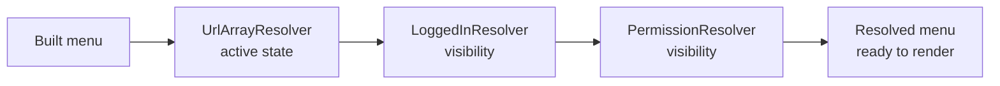

# Resolvers & Active State

Resolvers apply cross-cutting state without mixing request/session logic into menu construction.
Each resolver inspects every item and sets its active and/or visible state; chained together with a
`ResolverCollection`, they run in order, so later resolvers see what earlier ones decided.



## URL Resolvers

```php
use CakeMenu\Resolver\Psr7UrlResolver;
use CakeMenu\Resolver\UrlArrayResolver;

$menu->resolve(new Psr7UrlResolver($request));
$menu->resolve(new UrlArrayResolver($request));
```

`UrlArrayResolver` supports fuzzy matching, so a route like:

```php
['controller' => 'Articles', 'action' => 'view']
```

can match requests with additional passed parameters such as `/articles/view/42` when the item uses `fuzzy => true`.

It also supports named routes:

```php
$menu->addItem('View', ['_name' => 'articles:view']);
```

In apps that mix prefixed and non-prefixed routes, pass `'prefix' => false` on the non-prefixed links.
With fuzzy matching (the default), a link without a `prefix` key matches regardless of the current
prefix, the same way `Router::url()` inherits it from the current request:

```php
$menu->addItem('Articles', ['prefix' => false, 'controller' => 'Articles', 'action' => 'index']);
$menu->addItem('Admin Articles', ['prefix' => 'Admin', 'controller' => 'Articles', 'action' => 'index']);
```

## Section Resolver

`SectionResolver` activates items from request parameter subsets:

```php
use CakeMenu\Resolver\SectionResolver;

$menu->addItem('Admin Articles', '/admin/articles', [
    'data' => [
        'section' => [
            'prefix' => 'Admin',
            'controller' => 'Articles',
        ],
    ],
]);

$menu->resolve(new SectionResolver($request));
```

## Regex Resolver

`RegexResolver` activates items whose regular expression (stored in `data['match']`) matches the
current request path; handy for lighting up a whole URL section that a route-array match can't
express. A value may be a single pattern or a list; invalid patterns are ignored.

```php
use CakeMenu\Resolver\RegexResolver;

$menu->addItem('Admin', '/admin', [
    'data' => ['match' => '#^/admin/(users|roles)#'],
]);

$menu->resolve(new RegexResolver($request));
```

Pass a second argument to read patterns from a different data key, e.g.
`new RegexResolver($request, ['dataKey' => 'activePattern'])`.

`RegexResolver` accepts a `ServerRequestInterface` and matches only its URI path.
Set `['maxDepth' => 2]` to limit matching to the first two levels. As with the other
request resolvers, `null` scans the whole tree.

## Login Visibility Resolver

Mark items with metadata:

```php
use CakeMenu\Resolver\AuthState;

$menu->addItem('Login', '/login', ['data' => ['auth' => AuthState::LoggedOut]]);
$menu->addItem('Profile', '/profile', ['data' => ['auth' => AuthState::LoggedIn]]);
```

Then resolve:

```php
use CakeMenu\Resolver\LoggedInResolver;

$menu->resolve(new LoggedInResolver($identity !== null));
```

The `auth` data value accepts `AuthState` or its backed string (`'loggedIn'` or
`'loggedOut'`), including `Menu::fromArray()` configuration. Unknown strings throw
`InvalidArgumentException`.

## Authorization and Callback Resolvers

Both resolvers require a `Closure`. Convert method references with `$service->method(...)`.

```php
use CakeMenu\Item\ItemInterface;
use CakeMenu\Resolver\AuthorizationResolver;
use CakeMenu\Resolver\CallbackResolver;
use CakeMenu\Resolver\ResolverContext;

$menu->resolve(new AuthorizationResolver(
    static function (ItemInterface $item, ResolverContext $context): ?bool {
        if ($item->getData('permission') === null) {
            return null;
        }

        return $authorization->can($identity, (string)$item->getData('permission'), $item);
    }
));

$menu->resolve(new CallbackResolver(
    static function (ItemInterface $item, ResolverContext $context): void {
        if ($context->getDepth() > 1) {
            $item->setRuntimeExpanded();
        }
    }
));
```

## Permission Resolver

For Authorization-style `can()` services there is also a convenience resolver:

```php
use CakeMenu\Resolver\PermissionResolver;

$menu->addItem('Admin', '/admin', [
    'data' => ['permission' => 'admin.access'],
]);

$menu->resolve(new PermissionResolver($authorization, $identity));
```

The authorizer receives exactly `can($identity, $permission, $item)`, matching Cake's
`AuthorizationService::can($user, $action, $resource)`. A custom method name uses the same
three arguments; context is not passed.

## Multiple Resolvers

```php
use CakeMenu\Resolver\ResolverCollection;

$menu->resolve(
    (new ResolverCollection())
        ->add(new UrlArrayResolver($request))
        ->add(new LoggedInResolver($identity !== null))
);
```

## Adding Resolvers to the Defaults

::: warning A custom `resolver` replaces the defaults
Passing a `resolver` option **replaces** the built-in URL resolvers, so you lose automatic
active-state matching. To **keep** the defaults and add your own (for example a visibility resolver),
use `additionalResolvers` instead; they run after the URL resolvers.
:::

```php
use CakeMenu\Item\ItemInterface;
use CakeMenu\Resolver\AuthorizationResolver;

echo $this->Menu->render('main', [
    'additionalResolvers' => [
        new AuthorizationResolver(static function (ItemInterface $item): ?bool {
            return $item->getData('adminOnly') ? $isAdmin : null;
        }),
    ],
]);
```

## Depth-Limited Resolution

When rendering through the helper, you can limit how deep automatic URL resolution should scan:

```php
echo $this->Menu->render('main', [
    'resolveDepth' => 1,
]);
```


All resolvers implement `resolve(ItemInterface $item, ResolverContext $context): void`.
`Menu::resolve()` supplies the context. When resolving an item directly, pass a
`new ResolverContext()` as the second argument. Custom resolvers use `setRuntimeVisible()`,
`setRuntimeActive()`, and `setRuntimeExpanded()` to change request state.
